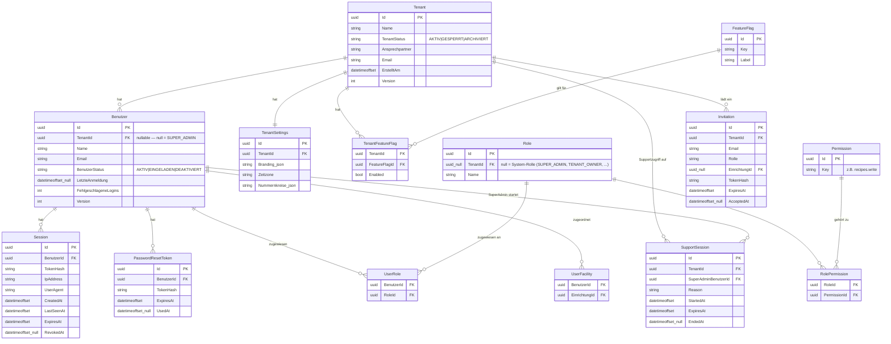
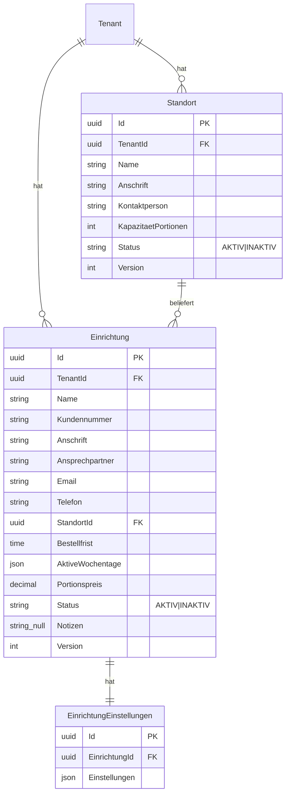
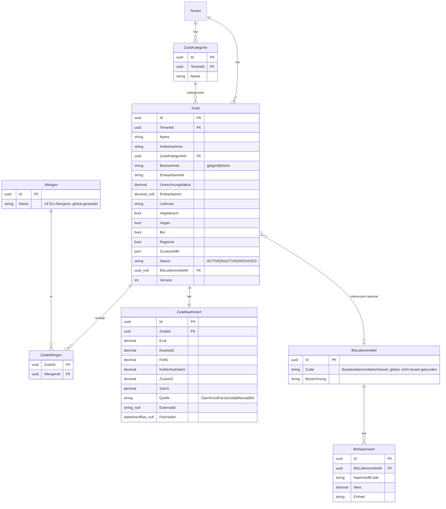
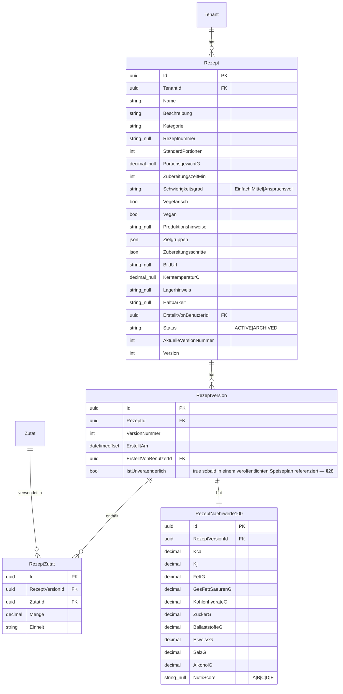
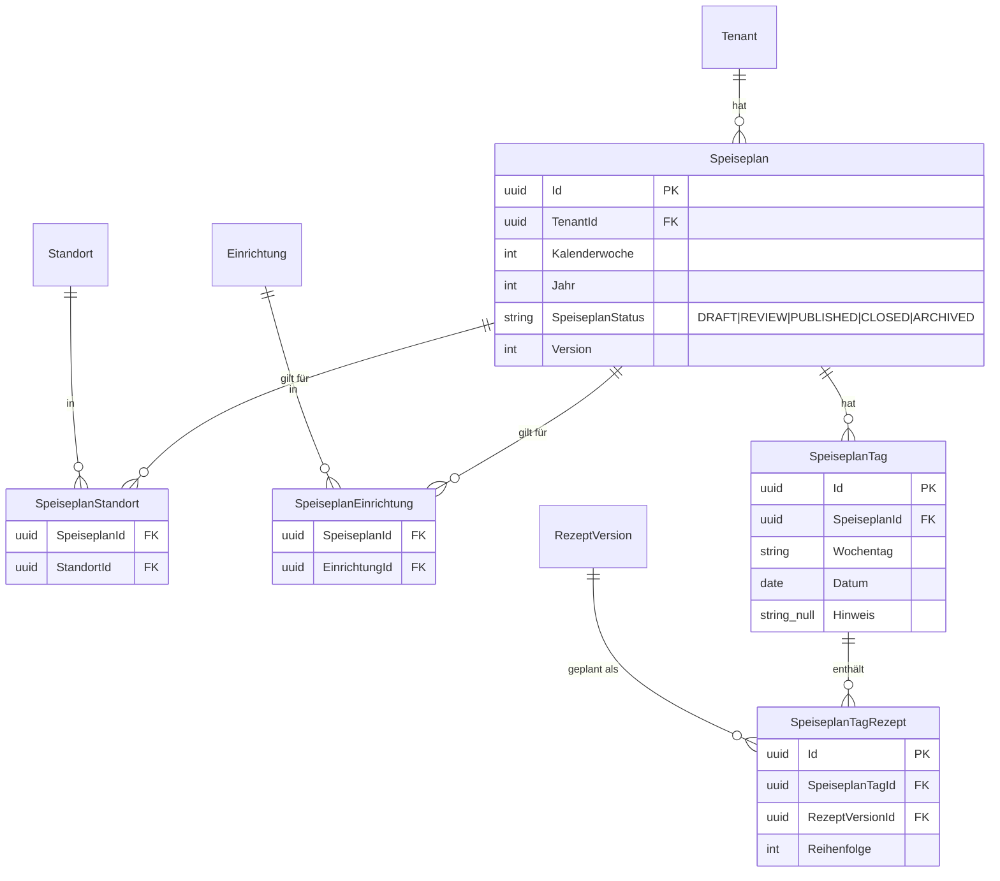
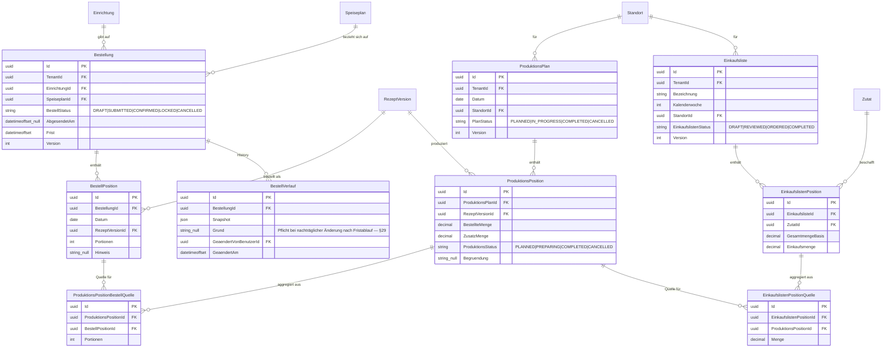
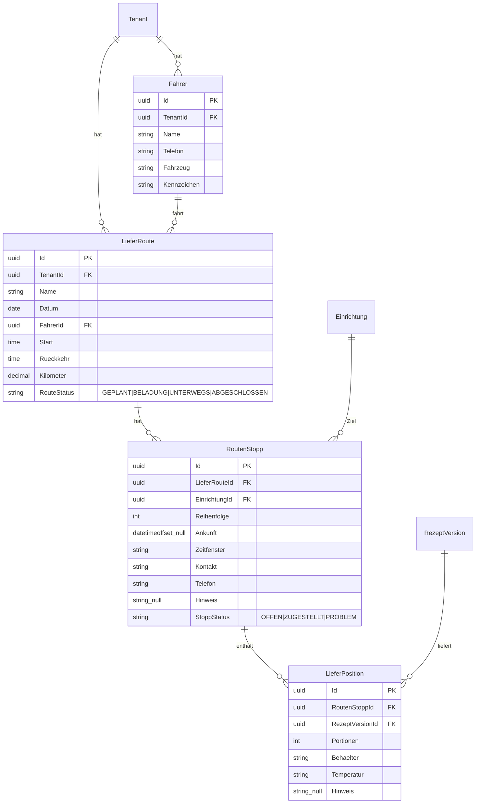
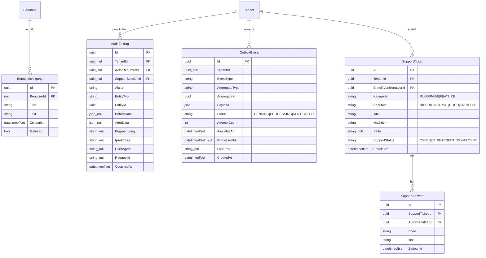

# Datenmodell — Daily Gourmet Backend

Zielplattform: **MS SQL Server** (MonsterASP-Hosting, siehe [ADR 0002](adr/0002-mssql-over-postgresql.md)), EF Core Code First, Migrations.

Dieses Dokument ist die **Grundlage zur Abstimmung, bevor die echte Datenbank aufgebaut wird**. Es zeigt das vollständige Zieldatenmodell über alle Phasen (§59) hinweg — implementiert wird es schrittweise, phasenweise, nicht auf einmal.

## Namenskonvention (wichtig, wurde direkt aus dem Frontend-Code abgeleitet)

Wo das Frontend (`frontend/src/lib/types.ts`, `frontend/src/features/*/types.ts`) bereits einen Typnamen für ein Konzept definiert, übernimmt das Backend **exakt diesen Namen** (z. B. `Rezept`, `Speiseplan`, `Bestellung`, `Einrichtung`, `Standort`, `Zutat`, `Tenant`, `ProduktionsPlan`, `Einkaufsliste`). Das Frontend mischt bewusst Deutsch (fachliche Catering-Begriffe) und Englisch (`Tenant` bleibt `Tenant`, nicht `Mandant`) — das Backend übernimmt diese Mischung 1:1, um Übersetzungsfehler zu vermeiden. Rein backend-seitige Infrastruktur-Konzepte, für die es **keine** Entsprechung im Frontend gibt (Sessions, Rollen/Permissions als eigenständiges RBAC, Invitations, Outbox, Support-Sessions, BLS-Referenzdaten), bekommen klare englische Namen.

Allgemeine Konventionen für alle Tabellen:
- `Id UNIQUEIDENTIFIER` (Guid) als Primärschlüssel.
- `TenantId` (+ Index) auf jeder mandantenbezogenen Tabelle (Ausnahme: global gültige Referenzdaten wie `Allergen`, `BlsLebensmittel`).
- `CreatedAt` / `UpdatedAt` als `datetimeoffset`.
- `Version` (Concurrency Token, `rowversion` oder `int`) auf allen veränderbaren Stammdaten-Aggregaten (§26).
- Geldbeträge/Mengen: `decimal`, nie `float`.
- String-Arrays (z. B. `AktiveWochentage`, `Zielgruppen`, `Zubereitungsschritte`) werden als **JSON-Spalte** abgebildet (EF Core Primitive Collections → JSON, SQL Server nativer `JSON`-Typ) — kein eigenes Join-Table-Overengineering für reine Werte-Listen ohne eigene Identität.

---

## 1. Identity & Tenant

> `Benutzer.Rolle` (fixes Enum aus dem Frontend: `SUPER_ADMIN, TENANT_OWNER, TENANT_ADMIN, KITCHEN_MANAGER, KITCHEN_STAFF, FACILITY_ADMIN, FACILITY_USER, READ_ONLY`) wird als **Systemrolle geseedet** (`Role.TenantId = null`) und dem Benutzer über `UserRole` zugewiesen — kein separates redundantes Enum-Feld auf `Benutzer`. Die API liefert im `GET /auth/me`-Response trotzdem ein einzelnes `rolle`-Feld (primäre/höchste Rolle), damit das Frontend unverändert bleibt.

## 2. Facilities

## 3. Catalog (Zutaten) + BLS-Referenzdaten

> Zwei Nährwert-Strategien existieren nebeneinander (`Quelle`-Enum deckt beide ab) — siehe [OPEN_QUESTIONS.md](OPEN_QUESTIONS.md) zur Priorisierung Open-Food-Facts/USDA vs. BLS.

## 4. Recipes & Versionierung

> Zentrale Geschäftsregel (§28): jede Änderung an einem Rezept erzeugt eine **neue** `RezeptVersion`; eine bereits veröffentlichte Version wird nie verändert (`IstUnveraenderlich = true`). `Speiseplan`-Einträge referenzieren immer eine konkrete `RezeptVersionId`, nie das Live-`Rezept`.

## 5. Meal Planning (Speisepläne)

## 6. Orders → Production → Procurement (mit Traceability, §38/§39)

## 7. Logistics (Lieferrouten — Fahrer-App)

> Existiert bereits als eigener Frontend-Bereich (`frontend/src/app/driver/*`, `frontend/src/features/logistics`), war aber nicht Teil des ursprünglichen Endpunkt-Katalogs (§34) — als Erweiterung ergänzt, damit Frontend und Backend deckungsgleich bleiben.

## 8. Platform (Notifications, Audit, Outbox, Support-Tickets)

`AuditEintrag` ist append-only (kein UPDATE/DELETE über die API, §33). `OutboxEvent` wird von einem `BackgroundService` verarbeitet (§31/§32), nie synchron innerhalb einer Geschäftstransaktion befüllt und sofort verschickt.

## Indexe (Mindestanforderung, §47)

`Benutzer(Email)` · `UserRole(BenutzerId, RoleId)` · `Einrichtung(TenantId, Status)` · `Standort(TenantId, Status)` · `Zutat(TenantId, Status, Name)` · `Rezept(TenantId, Status)` · `RezeptVersion(RezeptId, VersionNummer)` · `Speiseplan(TenantId, Jahr, Kalenderwoche, SpeiseplanStatus)` · `Bestellung(TenantId, EinrichtungId, BestellStatus)` · `Bestellung(SpeiseplanId, BestellStatus)` · `ProduktionsPlan(TenantId, StandortId, Datum)` · `Einkaufsliste(TenantId, StandortId, Kalenderwoche)` · `Benachrichtigung(BenutzerId, Gelesen, Zeitpunkt)` · `OutboxEvent(Status, AvailableAt)`.

## Phasenzuordnung

Dieses Dokument zeigt das **Zielbild**. Tatsächlich per EF-Core-Migration angelegt wird schrittweise:
- **Phase 1 (dieser Durchlauf):** keine der oben genannten Tabellen — nur die leere `AppDbContext`-Migrationspipeline (§59 Phase 1 enthält bewusst noch keine Fachlichkeit).
- **Phase 2:** Abschnitt 1 (Identity & Tenant, ohne Invitation/SupportSession — die kommen mit Phase 3/§14).
- **Phase 3:** Abschnitt 2 (Facilities) + Invitation/SupportSession aus Abschnitt 1.
- **Phase 4:** Abschnitt 3 (Catalog/Zutaten; BLS-Referenzdaten erst nach Klärung der offenen Frage).
- **Phase 5:** Abschnitt 4 (Recipes & Versionierung).
- **Phase 6:** Abschnitt 5 (Meal Planning).
- **Phase 7:** Abschnitt 6, Bestellungen-Teil (Orders).
- **Phase 8/9:** Abschnitt 6, Production/Procurement-Teil.
- **Phase 10:** Abschnitt 8 (Platform) + Abschnitt 7 (Logistics, sofern priorisiert).
